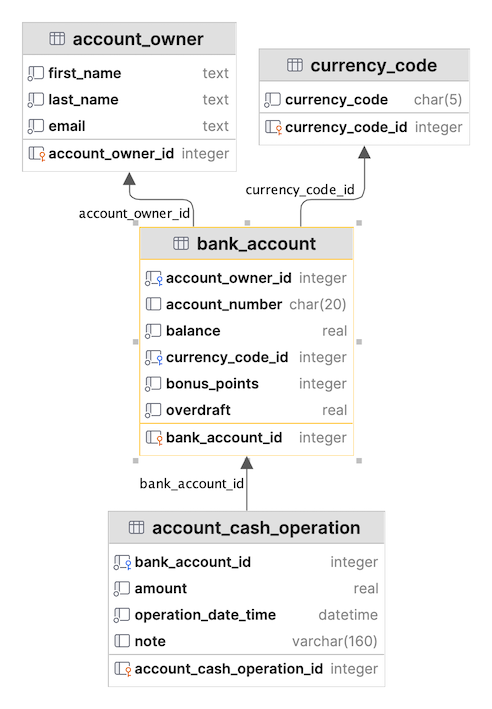

# Bank Account System (Entity Framework Core)

Intermediate level task for practicing Entity Framework model configuration and LINQ-to-SQL queries.

Estimated time to complete the task - 2h.

The task requires .NET 8 SDK installed.

## Task Description

This task is based on the *BankSystem* database. The database structure is shown on the diagram below:

Analyze and study the database diagram before starting the task.

### 1. Data Annotations

Configure the [Entity Framework models](https://learn.microsoft.com/en-us/ef/core/#the-model) for the *Bank System* database using the [data annotations](https://learn.microsoft.com/en-us/ef/core/modeling/#use-data-annotations-to-configure-a-model). The entities are the classes in the [Entities](BankSystem.DAL/Entities) folder.

* Apply the [TableAttribute](https://learn.microsoft.com/en-us/dotnet/api/system.componentmodel.dataannotations.schema.tableattribute) to all models to specify the database table that a model is mapped to.
* Apply the [ColumnAttribute](https://learn.microsoft.com/en-us/dotnet/api/system.componentmodel.dataannotations.schema.columnattribute) to a model properties to specify a database column that a model property is mapped to.
* Apply the [KeyAttribute](https://learn.microsoft.com/en-us/dotnet/api/system.componentmodel.dataannotations.keyattribute) to a model property that uniquely identifies an entity.
* Apply the [ForeignKeyAttribute](https://learn.microsoft.com/en-us/dotnet/api/system.componentmodel.dataannotations.schema.foreignkeyattribute) to a model property that is used as a foreign key in a relationship.

### 2. Bank models

In this section you have to implement few models that will be used in the sevices.

#### 2.1. Account Owner Total Balance Model

Implement the [AccountOwnerTotalBalanceModel](BankSystem.Services/Models/AccountOwnerTotalBalanceModel.cs) class that should contain public auto properties with get/set:
* AccountOwnerId (int);    
* FirstName (string);  
* LastName (string);   
* CurrencyCode (string);
* Total (decimal);

#### 2.2. Bank Account Full Information Model

Implement the [BankAccountFullInfoModel](BankSystem.Services/Models/BankAccountFullInfoModel.cs) class that should contain public auto properties with get/set:
* BankAccountId (int);    
* FirstName (string);  
* LastName (string);   
* AccountNumber (string);
* Balance (decimal);
* CurrencyCode (string);
* BonusPoints (int);

### 3. Bank services

In this section you have to implement few service methods that generate various models.

#### 3.1. Account Service

Implement the [GetBankAccountsFullInfo](BankSystem.Services/Services/AccountService.cs) method of the *AccountService* class:
* The method must return IReadOnlyList<BankAccountFullInfoModel>.
* You should use Linq to build result collection

#### 3.2. Owner Service

Implement the [GetAccountOwnersTotalBalance](BankSystem.Services/Services/OwnerService.cs) method of the *OwnerService* class:
* The method must return IReadOnlyList<AccountOwnerTotalBalanceModel>.
* You should use Linq to build result collection
* A result set must be sorted by the Total (descending).  
* You should use explicit type conversion (decimal to double and double to decimal) in your Linq query.  
