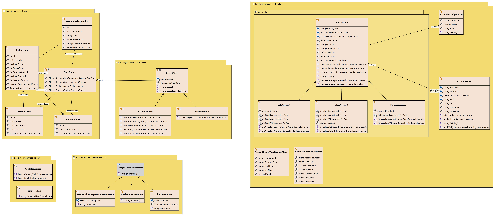

# Bank Account System (OOAD)

Intermediate level task for practicing object-oriented analysis and design.

_Estimated time to complete the task - 4h._

_The task requires .NET 8 SDK installed._

## Task Description

Implement classes that represent a banking system. To simulate a banking system, you can implement classes presented in the following class diagram:



## Classes Description

### 1. AcсountCashOperation Class

This class is designed to represent a bank account cash operation.

#### Properties

The class has three properties:

- `Amount` (`decimal`) property represents the amount of the bank operation.
- `Date` (`DateTime`) property represents the date and time of the bank operation.
- `Note` (`string`) property represents any notes associated with the bank operation.

#### Constructors

The `AccountCashOperation` class provides a single constructor for initializing instances of cash operations on a bank account.

This constructor requires three parameters:
- `amount` (`decimal`) parameter represents the amount the operation will manipulate.
- `date` (`DateTime`) parameter represents the time when the operation is done.
- `note` (`string`) parameter provides additional details about the operation.

#### Methods

- The class overrides the `ToString()` method to return a string that provides a detailed description of the operation, including amount, the date and time, note, and whether the operation was a credit or a debit.

### 2. AccountOwner Class

The `AccountOwner` class is used for representing a bank account owner.

#### Properties

This class contains the following properties:

- `FirstName` (`string`) property represents account owner's first name.
- `LastName` (`string`) property represents account owner's last name.
- `Email` (`string`) property represents account owner's email address.
- `AccountOwner` (`List<BankAccount>`) property represents a list of bank accounts associated with the account owner.

#### Constructors

The `AccountOwner` class provides a single public constructor for the initializing of its instances, representing the bank account owner.

This constructor requires three parameters:
- `firstName` (`string`) parameter represents the first name of the account owner.
- `lastName` (`string`) parameter represents the last name of the account owner.
- `email` (`string`) parameter represents the email address of the account owner.

#### Methods

- `ToString()` method returns a string containing the name and email of the account owner.
- `Add(BankAccount account)` method allows adding a new `BankAccount` instance to the list of accounts owned by the account owner.
- `Accounts()` method returns a list of `BankAccount` instances associated with the bank account owner:

### 3. BankAccount Class

The `BankAccount` class provides a way to work with bank accounts. This is an abstract class, so it cannot be instantiated directly.

#### Properties

This class includes the following properties:

- `Number` (`string`) property represents the bank account number.
- `Balance` (`string`) property represents the balance of the account.
- `CurrencyCode` (`string`) property represents the ISO currency code for the account (e.g., "USD", "EUR", "GBP").
- `Owner` (`AccountOwner`) property represents the owner of the bank account.
- `BonusPoints` (`int`) property represents the bonus points associated with the account; its value is updated with each deposit/withdrawal operation.
- `Overdraft` (`decimal`) property is specified in derived classes and determinate the overdraft limit for the account.

#### Constructors

The abstract `BankAccount` class provides four constructors to allow for various initializing of its instances, representing the bank account.

- The _first_ constructor accepts three parameters:
    - `owner` (`AccountOwner`) parameter represents an accountOwner object.
    - `currencyCode` (`string`) parameter represents the ISO currency code.
    - `uniqueNumberGenerator` (`IUniqueNumberGenerator`) parameter represents an object implementing `IUniqueNumberGenerator` interface, which is used for generating string representation of the unique account numbers.
- The _second_ constructor is very similar to the first; instead of taking an object implementing `IUniqueNumberGenerator`, it takes a `Func<string>` delegate named `numberGenerator`, giving the caller the flexibility of providing any function that generates a unique string.
- The _third_ constructor extends the first one by adding an `initialBalance` parameter, a decimal value used as an initial deposit upon creating the account.
- The _fourth_ constructor extends the second one in a similar way, by adding the `initialBalance` parameter.

#### Methods

The class includes the following methods:

- `GetAllOperations()` method returns all operations performed on the account.
- `Deposit()` method allows depositing money to account.
- `Withdraw()` method allows withdrawing money from the account.
- `CalculateDepositRewardPoints()` is abstract method, it should be implemented in subclass to specify how bonus points should be calculated upon deposit.
- `CalculateWithdrawRewardPoints()` is abstract method, it should be implemented in subclass to specify how bonus points should be calculated upon withdrawal.

#### Note

Because `BankAccount` is an _abstract_ class, you'll need to create a subclass in order to use most of this functionality. This ensures that the specific details associated with a given bank account type can be handled appropriately.

### 4. StandardAccount Class

`StandardAccount` is a class representing a _standard_ bank account in a banking system. It is _derived_ from the base class `BankAccount`, and it overrides some properties and methods from it.

#### Constants

The `StandardAccount` class declares the following constant that determine the reward point calculation:

- `StandardBalanceCostPerPoint = 100`

#### Constructors

The `StandardAccount` class provides three constructors:
- `StandardAccount(AccountOwner owner, string currencyCode, IUniqueNumberGenerator uniqueNumberGenerator)` constructor initializes a new `StandardAccount` with the specified owner, currency code, and a number generator.
- `StandardAccount(AccountOwner owner, string currencyCode, Func<string> numberGenerator)`: constructor initializes a new `StandardAccount` with the specified owner, currency code, and a function type number generator.
- `StandardAccount(AccountOwner owner, string currencyCode, IUniqueNumberGenerator uniqueNumberGenerator, decimal initialBalance)` constructor initializes a new `StandardAccount` with the specified owner, currency code, a number generator, and an initial balance.
- `public StandardAccount(AccountOwner owner, string currencyCode, IUniqueNumberGenerator uniqueNumberGenerator, decimal initialBalance)` constructor initializes  a new `StandardAccount` with the specified owner, currency code, a function type number generator, and an initial balance.

#### Properties

The `StandardAccount` class overrides the absract `Overdraft` property of the base `BankAccount` class:
- `Overdraft`: for the `StandardAccount`, overdraft is always 0.

#### Methods

The `StandardAccount` class overrides two methods of the base `BankAccount` class:
- `CalculateDepositRewardPoints(decimal amount)` method calculates reward points based on _balance_ only, using pre-defined calculation constant according to the formula:

```
DepositRewardPoints = max(⌊(Balance / StandardBalanceCostPerPoint)」, 0)
```
- `CalculateWithdrawRewardPoints(decimal amount)`: Calculates reward points based on _balance_ only, using pre-defined calculation constant according to the formula:

```
WithdrawRewardPoints = max(⌊(Balance / StandardBalanceCostPerPoint)」, 0)
```

Here:
- `⌊ x 」` rounds a specified `Decimal` number to the closest integer toward negative infinity (see [Decimal.Floor(Decimal) Method](https://learn.microsoft.com/en-us/dotnet/api/system.decimal.floor));
- `max(x, y)` gives the maximum of `x` and `y`.

### 5. SilverAccount Class

`SilverAccount` is a class representing a _silver_ bank account in a banking system. It is derived from the base class `BankAccount`, and it overrides some properties and methods from it.

#### Constants

The `SilverAccount` class declares the following constants that determine the reward point calculation:

- `SilverDepositCostPerPoint = 5`
- `SilverWithdrawCostPerPoint = 2`
- `SilverBalanceCostPerPoint = 100`

#### Constructors

The `SilverAccount` class provides three constructors:
- `SilverAccount(Owner owner, string currencyCode, IUniqueNumberGenerator uniqueNumberGenerator)` constructor initializes a new `SilverAccount` with the specified owner, currency code, and a number generator.
- `SilverAccount(Owner owner, string currencyCode, Func<string> numberGenerator)` constructor initializes a new `SilverAccount` with the specified owner, currency code, and a function type number generator.
- `SilverAccount(Owner owner, string currencyCode, IUniqueNumberGenerator uniqueNumberGenerator, decimal initialBalance)` constructor initializes a new `SilverAccount` with the specified owner, currency code, a number generator, and an initial balance.
- `SilverAccount(Owner owner, string currencyCode, IUniqueNumberGenerator uniqueNumberGenerator, decimal initialBalance)` constructor initializes a new `SilverAccount` with the specified owner, currency code, a function type number generator, and an initial balance.

#### Properties

The `SilverAccount` class overrides the abstarct `Overdraft` property of the base `BankAccount` class:
- `Overdraft`: for the `SilverAccount`, overdraft is equals to 2 * BonusPoints.

#### Methods

The `SilverAccount` class overrides two methods of the base `BankAccount` class:
- `CalculateDepositRewardPoints(decimal amount)` method calculates reward points based on _balance_ and _deposit_ amount, using pre-defined calculation constants according to the formula:

```
DepositRewardPoints = max( ⌊(Balance / SilverBalanceCostPerPoint)」+ ⌊ (Deposit / SilverDepositCostPerPoint)」, 0)
```
- `CalculateWithdrawRewardPoints(decimal amount)` method calculates reward points based on _balance_ and _withdrawal_ amount, using pre-defined calculation constants according to the formula:

```
WithdrawRewardPoints = max(⌊(Balance / SilverBalanceCostPerPoint)」 + ⌊(Deposit / SilverWithdrawCostPerPoint)」, 0)
```

Here:
- `⌊ x 」` rounds a specified `Decimal` number to the closest integer toward negative infinity (see [Decimal.Floor(Decimal) Method](https://learn.microsoft.com/en-us/dotnet/api/system.decimal.floor));
- `max(x, y)` gives the maximum of `x` and `y`.


### 6. GoldAccount Class

`GoldAccount` is a class representing a _gold_ bank account in a banking system. It is derived from the base class `BankAccount`, and it overrides some properties and methods from it.

#### Constants

The `GoldAccount` class declares the following constants that determine the reward point calculation:

- `GoldDepositCostPerPoint = 10`
- `GoldWithdrawCostPerPoint = 5`
- `GoldBalanceCostPerPoint = 5`

#### Constructors

The `GoldAccount` class provides three constructors:
- `GoldAccount(Owner owner, string currencyCode, IUniqueNumberGenerator uniqueNumberGenerator)` constructor initializes  a new `GoldAccount` with the specified owner, currency code, and a number generator.
- `GoldAccount(Owner owner, string currencyCode, Func<string> numberGenerator)` constructor initializes a new `GoldAccount` with the specified owner, currency code, and a function type number generator.
- `GoldAccount(Owner owner, string currencyCode, IUniqueNumberGenerator uniqueNumberGenerator, decimal initialBalance)`constructor initializes a new `GoldAccount` with the specified owner, currency code, a number generator, and an initial balance.
- `GoldAccount(Owner owner, string currencyCode, IUniqueNumberGenerator uniqueNumberGenerator, decimal initialBalance)`constructor initializes a new `GoldAccount` with the specified owner, currency code, a function type number generator, and an initial balance.

#### Properties

The `GoldAccount` class overrides the `Overdraft` property of the base `BankAccount` class:
- `Overdraft`: for the `GoldAccount`, overdraft is equals to `3 * BonusPoints`.

#### Methods

The `GoldAccount` class overrides two methods of the base `BankAccount` class:
- `CalculateDepositRewardPoints(decimal amount)` method calculates reward points based on _balance_ and _deposit_ amount, using pre-defined calculation constants according to the formula:

```
DepositRewardPoints = max( 「(Balance / GoldBalanceCostPerPoint)⌉+ 「(Deposit / GoldDepositCostPerPoint)⌉, 0)
```
- `CalculateWithdrawRewardPoints(decimal amount)` method calculates reward points based on _balance_ and _withdrawal_ amount, using pre-defined calculation constants according to the formula:

```
WithdrawRewardPoints = max(「(Balance / GoldBalanceCostPerPoint)⌉ + 「(Deposit / GoldWithdrawCostPerPoint)⌉, 0)
```

Here:
- `「 x ⌉` returns the smallest integral value that is greater than or equal to the specified `Decimal` number (see [Decimal.Ceiling(Decimal) Method](https://learn.microsoft.com/en-us/dotnet/api/system.decimal.ceiling));
- `max(x, y)` gives the maximum of `x` and `y`.

### 7. IUniqueNumberGenerator Interface

The `IUniqueNumberGenerator` interface outlines a contract for classes that aim to generate unique strings, used for unique identification bank account numbers.

#### Method
- `Generate()` method, when implemented, must generate a string that represents a unique number.

### 8. GuidGenerator Class

#### Method
- `Generate()` method provides a concrete implementation for the `IUniqueNumberGenerator` interface. This class generates a unique string based on a globally unique identifier (GUID)  with the help of the `CryptoHelper` class.

### 9. BasedOnTickUniqueNumberGenerator Class

#### Properties
- `startingPoint` (`DateTime`) property represents the initial point in time from which the elapsed time is calculated.

#### Constructors
The `BasedOnTickUniqueNumberGenerator` class has a single public constructor which initializes a new instance of this class. The constructor takes one parameter:
- `startingPoint` (`DateTime`) parameter represents the starting point in time from which the ticks (time) would be counted.

#### Method
- `Generate()` method overrides the `Generate()` method from the `IUniqueNumberGenerator` interface. It calculates the elapsed ticks (time) from the `startingPoint` to the current time, hashes this value and returns it as a string.

### 10. SimpleGenerator Class
The `SimpleGenerator` class serves as a simple unique number generator that generates sequential numbers. This class implements the `IUniqueNumberGenerator` interface and adheres to the _Singleton_ design pattern.

#### Fields

There is one private mutable field:
- `lastNumber`: An integer that represents the last number generated by `SimpleGenerator`. It's initialized to 1234567890.

#### Properties
- `Instance` property represents single instance of `SimpleGenerator`. This is a read-only property that gets created and initialized during the first call to the `Instance`.

#### Constructors
The `SimpleGenerator` class has two constructor without parameters:
- `SimpleGenerator()` is a private instance constructor, as per the _Singleton_ design pattern.
- `Static SimpleGenerator()` initializes `Instance` property.

#### Method
- `Generate()` method generates and returns a unique sequential number starting from previously generated number. Each newly generated number is hashed using the MD5 hashing algorithm for additional security and returned as a string.

### 11. ValidatorService Class

The `ValidatorService` class is a static helper class that provides methods for validation needs. It currently supports validation of currencies and emails.

#### Methods

- `IsCurrencyValid` extension method checks if the specified currency is valid. It makes use of the `CultureInfo` and `RegionInfo` classes to match the currency against a list of known currencies.
- `IsEmailValid` extension method verifies that a specified email is in a correct format.

### 12. CryptoHelper Class

The `CryptoHelper` class is a static helper class that provides a method for generating MD5 hashes from strings.

#### Method

- `GenerateHash(string input)` extension method generates an MD5 hash from an input string using the ASCII representation of the input. It returns the hashed string as output.

### Note

Please note that this project contains only class files and does not contain classes code. Therefore, we recommend starting with adding all the necessary types and their methods, using for these methods "stubs" like these

```
public sealed class AccountOwner
{
    . . .

    public AccountOwner(string? firstName, string? lastName, string? email)
    {
        throw new NotImplementedException();
    }

    . . . 
}
```

and then moving to a more detailed implementation that satisfies all the test requirements.